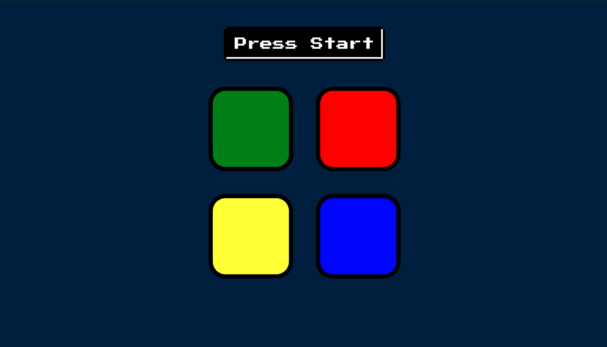

# MemoryGame
This is is an implementation of a memory game where you have to remember the pattern of clicks to progress in levels. The pattern becomes complex and lengthy as you progress.

### How to access ?
https://shridhar-t.github.io/MemoryGame

### Technology Used:
This was achieved by jQuery,DOM manipulation,CSS3 and HTMl5 and event handling (click events).

### ScreenShots

### I was not able to get beyond Level 20. Probably you can beat that :-/.

